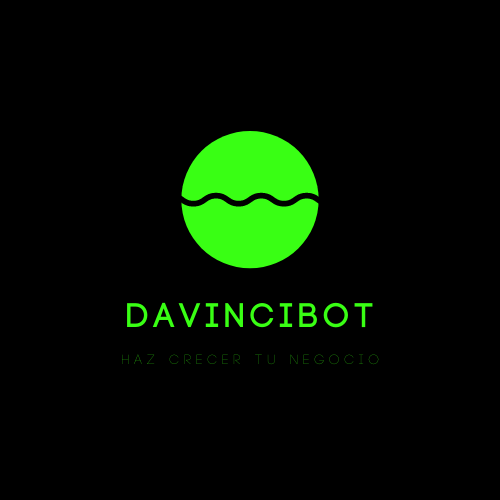

# DavinciBot
An Ai bot to be an artificial friend in times of COVID-19

## DEPLOY ON LOCAL

### Create a virtual environment (optional)

> python3 -m virtualenv ./.env
> source ./.env/bin/activate

### Install dependencies

> pip install -r requirements.txt

Python manage.py runserver 

Go to localhost:8080/bot/

